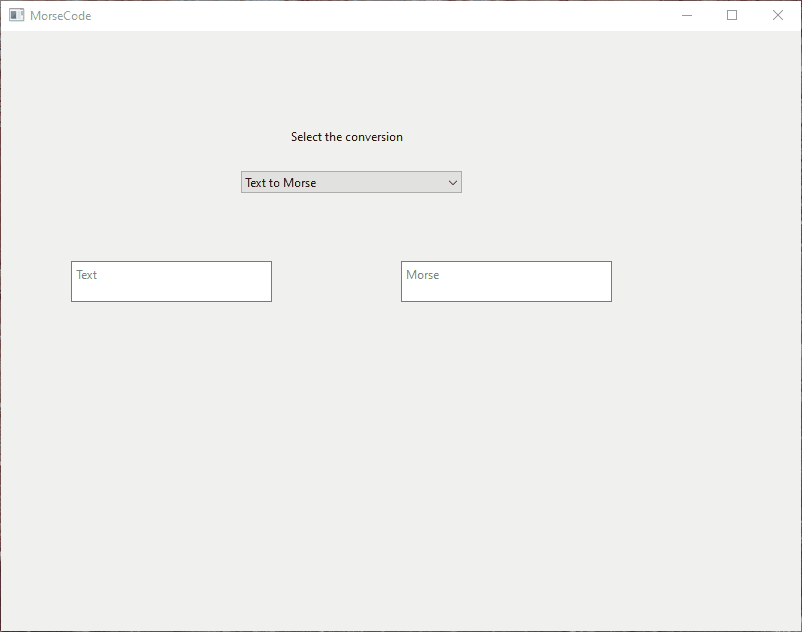
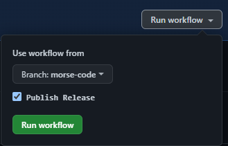

# qt-morsecode

## Introduction

This project converts plaintext to morsecode and vice-versa in realtime. We can choose the required conversion by selecting from the combobox. This project uses `International Morse Code`.

## Plaintext to Morse
- Uppercase, lowercase, spaces and numbers are supported.
- Converted morse uses `x` as character delimiter.
- A space is delimited as `xx`




## Morse to Plaintext
- Only uppercase, spaces and numbers are supported.
- Two successive morse characters are delimited by `x`
- A space is delimited as `xx`


## Building the application
The application is a QT Widget application and uses CMake to build.
```
cmake -DCMAKE_PREFIX_PATH=<qt-install-path> -B <build-dir> -G "Visual Studio 17 2022"
cmake --build <build-dir> --config Release
```

## Running Tests
- The application uses <QTest> for the unit tests
- To run the tests we go to the <build-dir> and run ctest to run all tests.
```
cd <build-dir> ; ctest -C Release -VV
```

## Creating Windows deployment
- We use `windeployqt` to prepare a Windows deployment along with related Qt dependencies.
- To create a deployment, we do
  ```
  windeployqt <path-to-built-qt-binary>
  ```

## Continuous Integration
- We use GitHub Actions to do CI.
- The workflow file is present here --> [build-qt.yml](.github/workflows/build-qt.yml)
- The workflow runs automatically
  - On a new push to main branch or
  - When a PR is created against the main branch
- The workflow
  - Installs QT
  - Sets up CMake
  - Installs MSBuild
  - Builds src & test projects
  - Creates a Windows deployment
  - Publishes the release conditionally based on workflow_dispatch

## Publishing a Release
- Currently a new release is published only when running the action manually.
- We use the workflow_dispatch to publish a release, by default it is set to false.
- To publish a release go to the [Actions](https://github.com/1337ninja/qt-morsecode/actions/workflows/build-qt.yml) tab.
- Then select `Run Workflow`, choose the branch, check `Publish Release` and select `Run Workflow` button

  